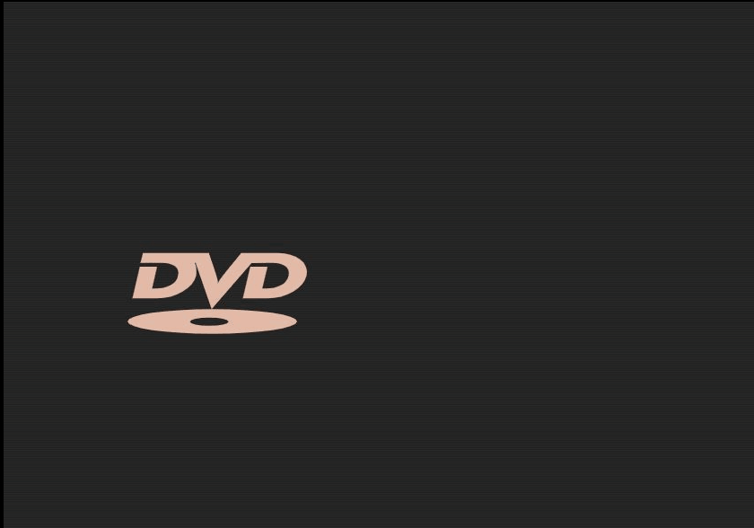

[![MIT License][license-shield]][license-url]
[![LinkedIn][linkedin-shield]][linkedin-url]

<!-- PROJECT LOGO -->
 

  <h3 align="center">Bouncing DVD Logo</h3>

  

    A take on the famous bouncing DVD Logo screensaver. View it <a href="https://dvd.sknk.ws/">here</a>
     
    
  

<!-- LICENSE -->
## License

Distributed under the MIT License. See `LICENSE` for more information.

<!-- ACKNOWLEDGEMENTS -->
## Acknowledgements

* [DVD Format/Logo Licensing Corporation](https://www.dvdfllc.co.jp/about/about.html)

<!-- MARKDOWN LINKS & IMAGES -->
<!-- https://www.markdownguide.org/basic-syntax/#reference-style-links -->
[license-shield]: https://img.shields.io/github/license/michaelmcallister/dvd.svg?style=flat-square
[license-url]: https://github.com/michaelmcallister/dvd/main/LICENSE.txt
[linkedin-shield]: https://img.shields.io/badge/-LinkedIn-black.svg?style=flat-square&logo=linkedin&colorB=555
[linkedin-url]: https://linkedin.com/in/mpmcallister